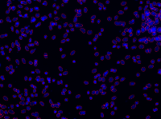
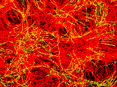

CellProfiler Pipelines
======================

A collection of pipelines for the [CellProfiler](http://www.cellprofiler.org/) cell image analysis software, developed with the neuroimmunology research group of [Prof C. Linington](http://www.gla.ac.uk/researchinstitutes/iii/staff/christopherlinington/) at the Institute of Infection, Immunity and Inflammation, University of Glasgow, UK.

Context
-------

These pipelines are used to characterise different glial cell cultures to quantify neurite density and myelination, differentiation of oligodendrocytes, proliferation and nuclei as well as cell densities (pixel intensity in various channels). Cell cultures analysed are either [dissociated myelinating cultures](http://link.springer.com/protocol/10.1007%2F7651_2014_129), neurosphere-derived astrocytes generated from striata of P1 Sprague-Dawley rats, or oligodendrocyte cultures purified from P1 rat cortex.

After a few days in culture, cells were fixed with 4% PFA and immunostained for different markers. Primary antibodies used were the following: SMI-31 (1:1500, Abcam), Z2 (anti-MOG, 1:200, clone Z2), PLP/AA3 (1:100, hybridoma supernatant supplied by S. Barnett), MBP (1:100, Millipore), Olig2 (1:1000, Millipore), and GFAP (1:500, Dako). Bound antibodies were visualized using appropriate combinations of species/isotype specific fluorochrome-conjugated secondary antibodies (1:500, Invitrogen, either 488nm or 568nm), followed by mounting in a media containing DAPI. To analyse cell proliferation, cells were pulsed with EdU and stained using the Click-iT EdU Alexa Fluor 594 Kit following the manufacturer's instructions.

Images were captured using an Olympus BX51 fluorescent microscope with standard filters for DAPI, GFP and Cy3. Images were saved as TIFFs at 300dpi (1392x1040 pixels). Each pipeline scans for `.tif` image files in the specified input folder and contained subfolders. A trailing number in the file name (before the extension) is extracted as variable `<Number>` and the subfolder name is stored as `<Group>` &ndash; these are reflected in the output file (`DATA.csv`). Furthermore, for each input image an output image in PNG format is generated, visualising the extracted data with the purpose of easy manual verification of the data generation process.

### [dapi.cp](dapi.cp)

Counts the number of stained nuclei (DAPI, EdU Alexa Fluor 594) in both culture systems for pictures in 20x magnification.

 | 
---|---
Original | Processed

The blue channel of the input image is extracted, illumination correction applied, and nucleic objects detected. The only measurement exported is the count of nuclei.

### [dapi-edu-aa3](dapi-edu-aa3.cp)/[olig2.cp](dapi-edu-olig2.cp)

Both pipelines quantify the absolute number of cells (as in `dapi.cp`), absolute number of proliferating cells (EdU Alexa Fluor 594), and absolute number of oligodendrocytes (Olig2 or AA3 stained for 488nm, respectively) as in `olig2-aa3.cp`. Furthermore, the amount of proliferating oligodendrocytes (EdU+/Olig2+ or EdU+/AA3+) is identified. Pictures were taken with 20x magnification.

The pipeline extracts red, green and blue channels from the input image and corrects for illumination. In the red and blue channels nucleic objects are identified; whereas the green channel gets a threshold applied, small features (Olig2) or myelin strings (AA3) are suppressed and remaining objects identified. Subsequently, green objects contained within red objects are determined, signifying proliferating oligodendrocytes.

Measurements exported are the counts of identified objects in all channels as well as the proportion of green objects contained within red objects (`Mean_RedObjects_Children_GreenObjects_Count`). To obtain the absolute number of double-positive (red and green) cells this proportion should be multiplied with the absolute number of red objects (`Count_RedObjects`).

### [myelin.cp](myelin.cp)

Provides quantitative analysis of axonal density and myelination (as proportion): the axonal marker SMI-31 (568nm) and myelin marker MOG (Z2, 488nm) were stained. This also works for other myelin markers such as MBP and PLP (AA3). Pictures were taken with 10x magnification.

 | 
---|---
Original | Processed

The pipeline extracts both the red and the green channel from the input image. The green channel is corrected for illumination, objects are detected and subsequently filtered for their shape, so that only strings of myelin are left. The red channel only gets a binary threshold applied. Measurements exported are the remaining areas as well as total image area in pixels.

### [olig2-aa3.cp](olig2-aa3.cp)

Analyses the number of OPCs and mature oligodendrocytes, when stained with Olig2 (568nm) and PLP (AA3, 488nm). Pictures were taken with 20x magnification.

 | 
---|---
Original | Processed

The pipeline extracts both the red and the green channel from the input image. The red channel is corrected for illumination, the remaining pixel intensity rescaled, a 25% threshold applied, small features suppressed and remaining objects identified. The green channel gets a threshold applied, myelin strings are suppressed and remaining objects identified. Measurements exported are the counts of identified objects in the red and green channels.

### [pixel-int-g](pixel-int-g.cp)/[r.cp](pixel-int-r.cp)

Quantifies pixel intensity in the green or red channel, respectively. This was optimised for gfap-stained astrocytes in myelinating cultures or neurosphere-derived astrocyte cultures in 20x magnification, but can easily be modified (re-set threshold) to be used to analyse any pixel intensity in the green or red channel.

 | 
---|---
Original | Processed

The respective channel is corrected for illumination, a threshold applied and the occupied area measured. Exported measurements are the area occupied as well as the total image area in pixels.

### High-throughput 96 Well Pipelines

The following pipelines have been designed/modified by Dr. Silvia Bijland, in work funded by NC3Rs (grant Ref. B004-13.1) and the UK MS Society (grant ref. 991), under the supervision of [Dr. Julia Edgar](https://www.gla.ac.uk/researchinstitutes/iii/staff/juliaedgar/) for the study: *"Functional characterisation of a murine in vitro model of CNS white matter and its utility as an experimental tool"* at the University of Glasgow and are based on `dapi.cp` and `myelin.cp`. For set up of mouse myelinating cultures and imaging refer to the above mentioned study.

Images were measured with the *In Cell Analyzer 2000* using the following 4 channels: Dapi (Hoechst), Fitch (green), TexasRed (red) and Brightfield at 10X magnification and 6 fixed fields per well.

Image processing using CellProfiler:
1. Quality control pipeline ([1_QCpipeline.cppipe](1_QCpipeline.cppipe)) will automatically flag images that do not meet any of the following criteria: Nuclei count > 1500, Axon area > 40%, PLLS < -2.0 and images that pass get 0, images that fail get 1.
2. Sort pipeline ([2_sortIMAGESpipeline.cppipe](2_sortIMAGESpipeline.cppipe)), where files with extension `*_0.tif` passed QC, files with extension `*_1.tif` failed QC
3. Illumination correction calculation ([3_calcILLUMpipeline.cppipe](3_calcILLUMpipeline.cppipe))
4. Analyse pictures ([4_PROCESSINGpipeline.cppipe](4_PROCESSINGpipeline.cppipe)) will generate a `.png` file of the resulting images and an Excel file containing: Nuclei count, axon area, myelin area, total area, filename and well info.

References
----------

* Lindner, M. et al: *[Myelinating Cultures: An In Vitro Tool to Identify Demyelinating and Axopathic Autoantibodies](https://link.springer.com/protocol/10.1007%2F7651_2014_129).* In Methods Mol Biol., Nov 2014.

* Lindner, M., Thümmler, K. et al: *[Fibroblast growth factor signalling in multiple sclerosis: inhibition of myelination and induction of pro-inflammatory environment by FGF9](http://brain.oxfordjournals.org/content/early/2015/04/22/brain.awv102.long).* In Brain, April 2015.

* Lindsay, SL. et al: *[Comparative miRNA-Based Fingerprinting Reveals Biological Differences in Human Olfactory Mucosa- and Bone-Marrow-Derived Mesenchymal Stromal Cells.](https://www.cell.com/stem-cell-reports/fulltext/S2213-6711(16)30004-2?_returnURL=https%3A%2F%2Flinkinghub.elsevier.com%2Fretrieve%2Fpii%2FS2213671116300042%3Fshowall%3Dtrue)* In Stem Cell Reports, May 2016.

* Cumberworth, SL. et al: *[Zika virus tropism and interactions in myelinating neural cell cultures: CNS cells and myelin are preferentially affected.](https://actaneurocomms.biomedcentral.com/articles/10.1186/s40478-017-0450-8)* In Acta Neuropathologica Communications, June 2017.

* Bijland, S. et al: *[An in vitro model for studying CNS white matter: functional properties and experimental approaches.](https://f1000research.com/articles/8-117/v1)* In F1000Res, Jan 2019.

* McCanney, GA. et al: *[Low sulfated heparins target multiple proteins for central nervous system repair.](https://onlinelibrary.wiley.com/doi/full/10.1002/glia.23562)* In Glia, April 2019.

* McCanney, GA. et al: *[The Use of Myelinating Cultures as a Screen of Glycomolecules for CNS Repair.](https://www.mdpi.com/2079-7737/8/3/52)* In Biology (Basel), Jun 2019.

* Thümmler, K. et al: *[Polarizing receptor activation dissociates fibroblast growth factor 2 mediated inhibition of myelination from its neuroprotective potential.](https://actaneurocomms.biomedcentral.com/articles/10.1186/s40478-019-0864-6)* In Acta Neuropathologica Communications, Dec 2019.

License
-------

Copyright &copy; 2015 Steve Mücklisch

This work is licensed under a [Creative Commons Attribution 3.0 Unported License](http://creativecommons.org/licenses/by/3.0/deed.en_GB).
